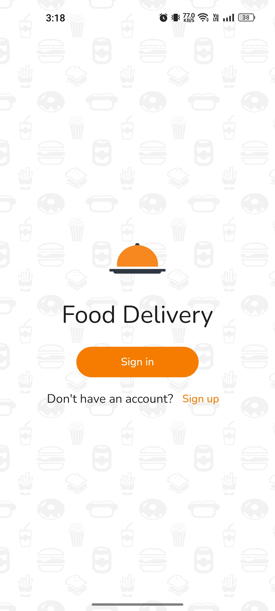
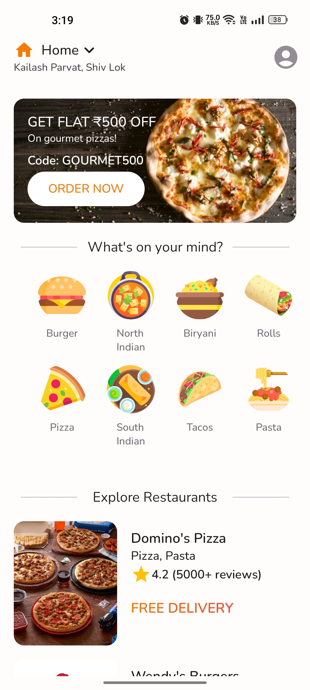
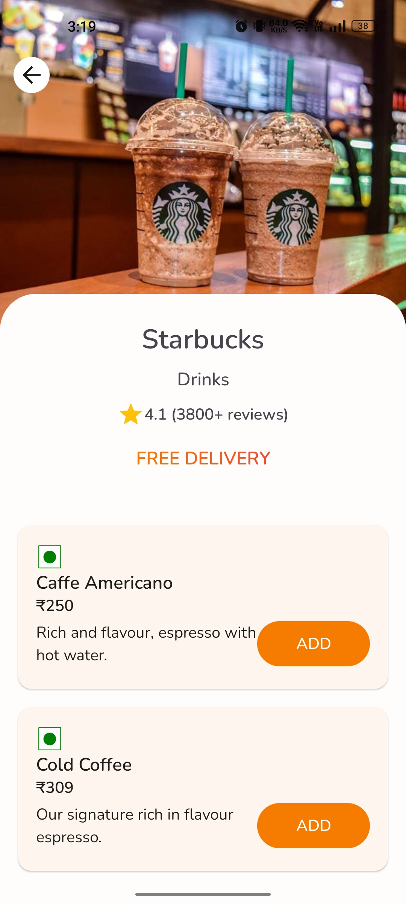

## Food Delivery app developed with Jetpack Compose.

### Features
• MVVM architecture.\
• Data is fetched from a sample api (hosted as a gist) using Retrofit.\
• Image loading is done with Coil.\
• Dependency injection using Hilt.

### Screeenshots
  

### Credit
Icons by <a href = "https://www.flaticon.com/authors/freepik">Freepik</a> on <a href = "https://www.flaticon.com/">Flaticon</a>\
Lottie files by <a href = "https://lottiefiles.com/ek78l41caayqoqyl">0440 Molly</a> & <a href = "https://lottiefiles.com/balajirao">Pathange Balaji Rao</a>
